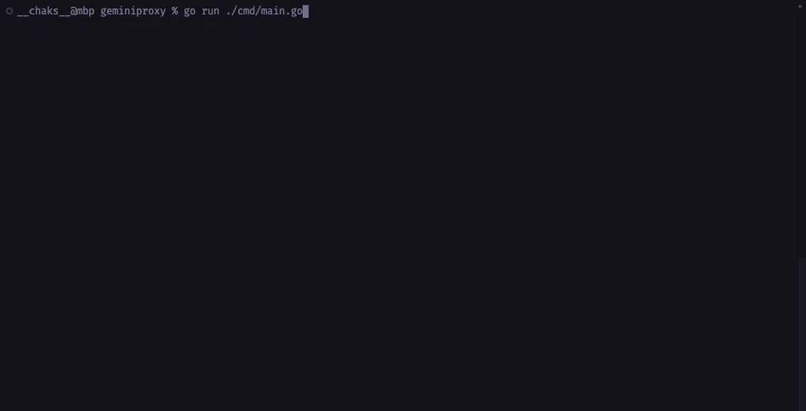

<div align="center">
  <h1>geminiproxy</h1>
  <br/>
</div>



A simple Go proxy server for the Gemini API that provides automatic API key rotation.

## Features

- Proxies requests to the Gemini API
- Automatically rotates through multiple API keys in round-robin fashion
- Transparent to clients - they don't need to provide API keys
- Compatible with go-genai client library

## Setup

1. Clone the repository:

   ```bash
   git clone git@github.com:ChakshuGautam/geminiproxy.git
   cd geminiproxy
   ```

2. Create a `gemini.keys` file in the root directory with your Gemini API keys (one per line):

   ```
   # API Keys (one per line)
   AIzaSyA...key1
   AIzaSyB...key2
   AIzaSyC...key3
   ```

3. Build and run:
   ```bash
   go build -o geminiproxy ./cmd/geminiproxy
   # Then run the executable
   ./geminiproxy
   ```
   Alternatively, to run the test client:
   ```bash
   go run ./cmd/test_client.go
   ```

## Docker Setup

Alternatively, you can build and run the proxy using Docker and Docker Compose.

1.  **Prerequisites:** Ensure you have Docker and Docker Compose installed.
2.  **Create `gemini.keys`:** As described in the main setup, create a `gemini.keys` file in the project root directory containing your Gemini API keys (one per line). **Important:** Add `gemini.keys` to your `.gitignore` file.
3.  **Build and Run with Docker Compose:**
    ```bash
    docker-compose up --build -d
    ```
    This command will build the Docker image (if it doesn't exist) and start the proxy container in the background. The proxy will be accessible at `http://localhost:8081`.
4.  **Stopping the Container:**
    ```bash
    docker-compose down
    ```

## Usage

### Usage with go-genai Client

```go
import (
	"context"
	"github.com/google/generative-ai-go/genai"
)
func main() {
	ctx := context.Background()
	client, err := genai.NewClient(ctx,
		option.WithAPIKey("DUMMY_API_KEY"),
		option.WithEndpoint("http://localhost:8081"), //proxy starts at this port
	)
	// Use the client normally
	model := client.GenerativeModel("gemini-2.0-flash")
	prompt := "Write a short poem about Go programming"

	resp, err := model.GenerateContent(ctx, genai.Text(prompt))
}
```

A complete example demonstrating API key rotation across multiple requests is provided in the [test_client.go](./cmd/test_client.go) file. When you run it, you'll see each request using a different API key from your key pool.

## License

MIT
